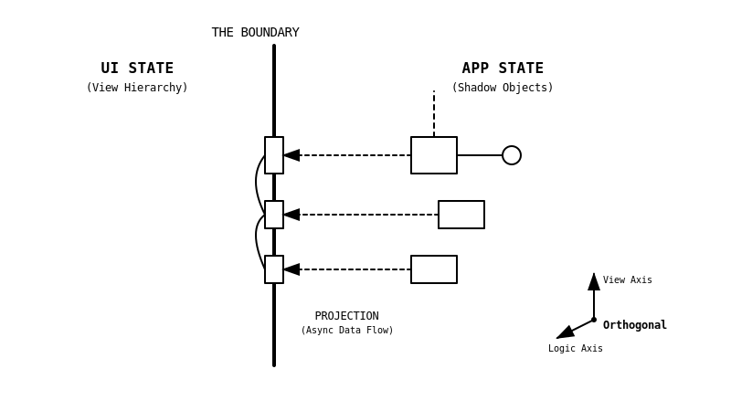

# shadow-objects

A reactive Entity&larr;Component Framework that feels at home in the shadows 🧛

> [!WARNING]
> 🚀 This is a highly experimental framework that is slowly maturing. Use at your own risk. 🔥

---

## 🎭 The Mental Model: The Shadow Theater

Imagine a **web application** like a classic **Shadow Theater**:

*   **The Screen (View):** What the user sees – the DOM elements and UI components.
*   **The Puppets (Entities):** The abstract objects in the background representing the actual scene.
*   **The Puppeteer (Shadow Object):** The logic pulling the strings. The puppeteer decides how the puppets move but remains invisible to the audience.

**The Problem with Traditional Frameworks:**
Logic (puppeteer) and presentation (screen) are often mixed in the same thread (Main Thread). This works well for document-centric applications, but friction arises in complex, rich interactions like 3D configurators, game engines, or data-intensive tools and leads to complexity bottlenecks because UI rendering blocks business logic – and vice versa.

**The Solution by `shadow-objects`:**
We separate the worlds strictly.



1.  **In the Light (Main Thread):** The dumb View. It only displays and forwards events.
2.  **In the Shadow (Web Worker _or_ Main Thread):** The smart Logic. This is where **Entities** and **Shadow Objects** live. They process data, calculate states, and "project" the result back onto the screen.

Through this architecture, your application logic runs parallel to the UI, decoupled and reactive.

---

## 📚 Documentation

**The complete and authoritative documentation is located in the [`packages/shadow-objects/docs/`](packages/shadow-objects/docs/) directory.**

*   [**Fundamentals**](packages/shadow-objects/docs/01-concepts/): Understand the mental model, architecture, and lifecycle in detail.
*   [**Guides**](packages/shadow-objects/docs/02-guides/): Step-by-step instructions for getting started.
*   [**API Reference**](packages/shadow-objects/docs/03-api/): Detailed description of the interfaces.

---

## 🏗️ Project Structure (Monorepo)

This repository is a monorepo managed with [nx](https://nx.dev/) and [pnpm](https://pnpm.io/).

### Core Packages

| Package | Description |
| :--- | :--- |
| **[`shadow-objects`](packages/shadow-objects/)** | The heart. The core library of the framework. |
| **[`shae-offscreen-canvas`](packages/shae-offscreen-canvas/)** | A Custom Element implementing an **Offscreen Canvas** – demonstrates the power of `shadow-objects` for graphics applications. |
| **[`skills`](packages/skills/)** | **Agent Skills** for AI assistants to help with `shadow-objects` development. |

### Testing & Quality Assurance

| Package | Description |
| :--- | :--- |
| **[`shadow-objects-testing`](packages/shadow-objects-testing/)** | Functional and integration tests. |
| **[`shadow-objects-e2e`](packages/shadow-objects-e2e/)** | End-to-End tests using [Playwright](https://playwright.dev/). |

---

## ⚡ Available Scripts

Run these commands from the root directory:

| Command | Description |
| :--- | :--- |
| `pnpm cbt` | **Clean, Build, Test.** Runs a full cycle: clean, build, and test the entire workspace. |
| `pnpm start` | Starts the **shae-offscreen-canvas** demo server. |
| `pnpm test` | Runs all tests (Unit, Integration, E2E) across all packages. |
| `pnpm test:ci` | Runs tests excluding E2E (faster, for CI pipelines). |
| `pnpm build` | Builds all packages. |
| `pnpm lint` | Runs linter across the entire workspace. |
| `pnpm clean` | Deletes all build artifacts (`dist`, `build` folders). |

---

## ⚙️ Development Setup

1.  **Prerequisites:** Node.js >=20.12.2, pnpm >=9.1.2
2.  **Install Dependencies:**
    ```sh
    pnpm install
    ```
3.  **Install Playwright Browsers (for E2E Tests):**
    ```sh
    cd packages/shadow-objects-e2e
    pnpm exec playwright install chromium firefox
    cd ../..
    ```
