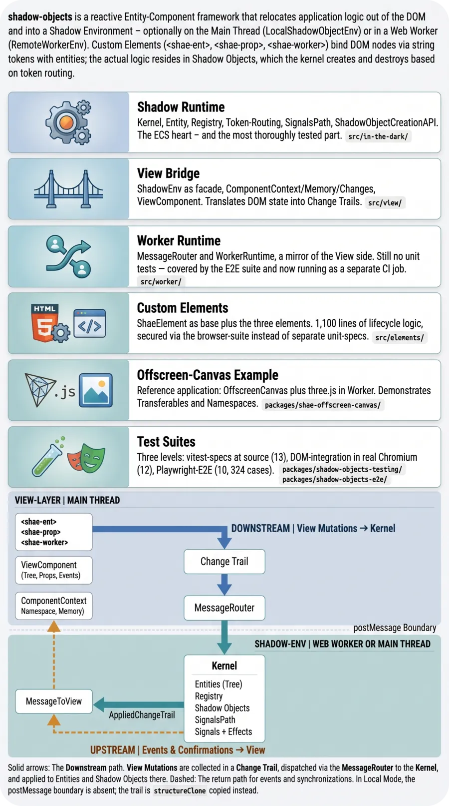

# 🌑 Shadow-Objects

*A reactive entity-component framework that feels at home in the shadows* 🧛

**A reactive Entity-Component-System (ECS) that moves your application logic out of the UI thread and into the shadows.**

Shadow Objects separates your application logic from its presentation. It treats your UI (React, Vue, or plain DOM) merely as a *renderer*, while your actual state and business logic run in a dedicated "Shadow Environment" — either on the main thread or fully offloaded to a Web Worker. 

If you've ever worked with a game engine, this will feel familiar: **Your UI is the renderer, Shadow Objects is the game world.**

> [!WARNING]
> 🚀 This is a highly experimental framework that is slowly maturing. Use at your own risk. 🔥

## ✨ Your Superpowers (Why use it?)

Shadow Objects doesn't replace your UI framework; it supercharges the logic layer underneath it. It gives you:

*   **🧵 True Thread-Agnostic Logic:** Write your application logic once. Run it locally (Main Thread) or in a Web Worker. Your `Shadow Object` code remains exactly identical — only the proxy gets swapped.
*   **⚡️ Unblocked UI:** By offloading state calculation to a Web Worker, your UI thread remains butter-smooth, even when dealing with complex, reactive data trees.
*   **🏗️ Decoupled Hierarchy:** The DOM structure produced by React/Angular rarely matches your true application logic. Shadow Objects lets your logic live in its own clean ECS hierarchy, which is merely *spanned and queried* by the View.
*   **🔄 Seamless Reactivity:** Powered by `@spearwolf/signalize` and `@spearwolf/eventize`, data syncs reactively and efficiently across thread boundaries.

## 🏗️ How it Works (Architecture at a Glance)

Shadow Objects bridges the gap between the DOM and the ECS Kernel using a highly optimized, asynchronous protocol based on serialized **Change Trails**.

1. **The View (DOM):** Custom Elements (`<shae-ent>`, `<shae-prop>`, `<shae-worker>`) anchor your logic to the DOM. They define *what* exists and *how* it's structured.
2. **The Change Trail:** Mutations in the View are collected in a Change Trail and sent via a MessageRouter across the boundary (e.g., `postMessage`).
3. **The Kernel (Shadow Env):** The ECS heart receives the Trail. Based on Token-Routing, the Registry creates and destroys **Shadow Objects** (your logic components) and binds them to Entities.



More details are in [concepts.md](packages/shadow-objects/docs/concepts.md#1-the-mental-model).

---

## Quick Look

```html
<!-- index.html -- the view layer -->
<script type="module">
  import '@spearwolf/shadow-objects/elements.js';
</script>

<shae-worker src="./my-logic.js"></shae-worker>

<shae-ent token="my-component">
  <shae-prop name="step" value="1" type="int"></shae-prop>
</shae-ent>
```

```javascript
// my-logic.js -- runs in the shadow environment
// A shadow object is an ECS component: the body is the setup phase, after that it only reacts.
// It runs once, for as long as this shadow object stays on the entity.
function MyComponent({useProperty, createSignal, onViewEvent, dispatchMessageToView}) {
  const step = useProperty('step');
  const count = createSignal(0);

  onViewEvent((type) => {
    if (type === 'increment') {
      count.set(count.value + (step() ?? 1));
      dispatchMessageToView('count-changed', {value: count.value});
    }
  });
}

// The module exports the registry (component manifest) under the name `shadowObjects` --
// the loader reads exactly that named export. A view node with the token 'my-component'
// gets this shadow object.
export const shadowObjects = {
  define: {
    'my-component': MyComponent,
  },
};
```

Full walkthrough: [getting-started.md](packages/shadow-objects/docs/getting-started.md).

---

## 📦 What's in the Box? (Project Structure)

The framework is strictly modularized into functional domains.

### Core Runtimes
*   **`src/in-the-dark/` (The Shadow Runtime):** The ECS heart. Contains the Kernel, Entity tree, Registry, Token-Routing, and SignalsPath. This is where your logic executes.
*   **`src/worker/` (Worker Runtime):** The mirror of the View side. Contains the `MessageRouter` and WorkerRuntime to enable Web Worker execution.
*   **`src/view/` (The View Bridge):** The Facade (`ShadowEnv`) and `ComponentContext`. It translates DOM state into serialized Change Trails.

### Integrations & Elements
*   **`src/elements/` (Custom Elements):** The HTML bindings (`ShaeElement` base plus `<shae-ent>`, `<shae-prop>`, `<shae-worker>`). Over 1,100 lines of robust lifecycle logic.

### Examples & Testing
*   **`packages/shadow-offscreen-canvas/`:** A reference implementation demonstrating heavy lifting! Runs `three.js` in a Worker, proving the power of Transferables and Namespaces.
*   **`packages/shadow-objects-testing/` & `e2e`:** Massive test suite spanning unit tests (vitest), real DOM integration in Chromium, and E2E specs via Playwright.

---

## The Five Domains

The framework splits into five domains. The line between domain 4 and domain 5 is the important one: it separates *composition* of logic from the logic itself.

| #   | Domain            | Responsibility                               | Where it lives         |
| --- | ----------------- | -------------------------------------------- | ---------------------- |
| 1   | **View**          | Structure, properties, input                 | always the main thread |
| 2   | **Environment**   | Place of execution, transport                | main thread or worker  |
| 3   | **Kernel**        | Lifecycle, entity tree                       | inside the environment |
| 4   | **Composition**   | Registry, token, routing                     | inside the environment |
| 5   | **Shadow Object** | Application logic, reactivity, communication | inside the environment |

### 1. View -- Structure and Input

The View decides what exists. It is the only part of the system allowed to do that.

**Owns:** the set of View Components, their hierarchy, their properties, the token per node, the moment of creation and destruction, and dispatching events toward the logic.

**Does not own:** application logic, entity IDs, the question of which Shadow Objects come into being.

**Building blocks:** `ViewComponent` as the programmatic API, with the custom elements `<shae-ent>`, `<shae-prop>`, and `<shae-worker>` as the declarative variant on top. `ComponentContext` collects all View Components of a namespace. `ComponentChanges` and `ComponentMemory` keep the books on what changed since the last sync.

Both entry points, the JavaScript API and the web components, mix freely in the same app. The custom elements call nothing but the `ViewComponent` API internally. That is why the View works just as well over a GLTF scene graph, a canvas renderer, or a React tree as it does over the DOM.

**Boundary:** the View knows tokens, not constructors. It says "here is a `player`", never "here runs `PlayerLogic`".

### 2. Environment -- Place and Transport

This domain answers exactly one question: where does the logic run, and how do the messages get there?

**Owns:** the choice of execution site, the message protocol, the sync tempo, the marshalling of data across the thread boundary.

**Does not own:** anything domain-specific. You can swap this layer without changing a single line of application code.

**Building blocks:** `ShadowEnv` is the facade that marries a `ComponentContext` to a proxy. `IShadowObjectEnvProxy` is the contract, `LocalShadowObjectEnv` and `RemoteWorkerEnv` are the two implementations. On the worker side, `MessageRouter` and `WorkerRuntime` mirror the whole thing.

The transport is a change trail. `ShadowEnv.sync()` collects everything that changed since the last run into a batch and ships it across. `<shae-worker auto-sync>` drives that per frame, at a fixed rate, or not at all. For local environments you can switch off structured cloning, and then references travel instead of copies.

Both modes are first-class. **Local is not a debugging crutch, and remote is not an optimization trick.** Local mode is the only way to hand non-cloneable objects such as DOM references or canvas contexts straight to a Shadow Object.

**Boundary:** two environments never talk to each other directly. The main thread is the bus.

### 3. Kernel -- Lifecycle and Entity Tree

The Kernel is the machine inside the environment. It takes change trails in and turns them into a living tree.

**Owns:** the entity tree, entity identity, the four lifecycle phases `create`, `mount`, `active`, `destroy`, and the traversal order.

**Does not own:** the mapping from token to constructor. For that it asks the Registry.

**Building blocks:** `Kernel` with `run()`, `getEntity()`, `traverseLevelOrderBFS()`, `getEntityGraph()`, `upgradeEntities()`. `Entity` with its parent-child relation, `traverse()`, properties, and event emitter capability.

An Entity is stateful and still has no logic. That is not a contradiction, that is the core claim of ECS: it holds properties, contexts, and an event bus, but it does nothing with them. Everything that reacts to that state is a Shadow Object.

**Boundary:** the Kernel never creates structure on its own. It executes what the View tells it.

### 4. Composition -- Registry and Routing

Here is where the decision falls that neither the View nor the Entity makes: which Shadow Objects land on this entity?

**Owns:** the mapping from tokens to constructors, and the rules by which one token turns into several.

**Does not own:** state. The Registry is configuration, not a runtime object of your application.

**Building blocks:** `Registry` and the module object that `<shae-worker src>` points at. A module knows four keys:

- `define` maps tokens to constructors.
- `routes` composes. One token pulls in further tokens, recursively, and conditionally via `'@propName'`, so a property on the entity can decide about additional logic.
- `extends` pulls in other modules.
- `initialize` runs asynchronously at load time and may add definitions later, for example after a feature flag request.

This is the second decoupling in the framework, and the underrated one. The first separates View from logic. This one separates the composition of logic from the place it is used. Cross-cutting behavior such as logging, analytics, or a debug overlay gets attached to entities without a single line of HTML changing.

**Boundary:** routing decides about existence, not about behavior. What the Shadow Objects do with each other afterwards is written inside them.

### 5. Shadow Object -- Logic, Reactivity, Communication

This is where your application lives.

**Owns:** behavior, local state, reaction to change, communication upward, downward, and sideways, and cleanup.

**Does not own:** its own existence and its own lifecycle.

A Shadow Object is a function or a class. The body runs once per shadow object at `mount` and builds the reactive graph. After that nothing runs top to bottom any more, it only reacts. A token change or a `'@propName'` route switch sets up only the shadow objects that arrive on the entity and tears down only the ones that leave; the rest keep running untouched. The `ShadowObjectCreationAPI` hands you four toolboxes for that:

| Toolbox    | Tools                                                                      | What for                                                                     |
| ---------- | -------------------------------------------------------------------------- | ---------------------------------------------------------------------------- |
| Inputs     | `useProperty`, `useProperties`                                             | read properties from the View as signals                                     |
| Reactivity | `createSignal`, `createMemo`, `createEffect`, `createResource`             | own state, derived values, side effects, external resources with a lifecycle |
| Context    | `provideContext`, `provideGlobalContext`, `useContext`, `useParentContext` | dependency injection along the entity tree                                   |
| Events     | `onViewEvent`, `dispatchMessageToView`, `on`, `emit`                       | talking to the View, to siblings, and to the subtree                         |

Several Shadow Objects on the same entity share its properties, its contexts, its event bus, and its lifetime. That is exactly where composition comes from: `player` is not one big class, it is `PhysicsBody` plus `Health` plus `RenderMesh`, talking over the entity bus and needing no import of each other.

Shadow Objects are never nested inside one another. Hierarchy is the entities' business.

**Boundary:** signals, effects, memos, and listeners registered through the API are cleaned up by the framework on `destroy`. Everything outside of that -- intervals, sockets, foreign listeners -- belongs in `onDestroy` or in a `createResource`.

---

## Data Flow

Three directions, and they never cross.

**Downstream, properties.** The View sets a property, `ComponentChanges` books it, `sync()` ships the change trail, the Kernel writes it to the entity, the signal from `useProperty` fires, dependent effects run. The View pushes data, it never calls logic.

**Upstream, messages.** A Shadow Object calls `dispatchMessageToView`, the Kernel emits `MessageToView`, the proxy carries it across the thread boundary, the `ViewComponent` fires it as an eventize event. With `forward-custom-events` it additionally becomes a DOM `CustomEvent` on the `<shae-ent>`. The logic knows no DOM, it only knows message types.

**Lateral, context and entity bus.** Contexts travel from ancestors to descendants and are signals, so consumers update themselves. Events on the entity reach every Shadow Object of that node, and `entity.traverse()` reaches the subtree. For frame ticks, resize events, or global state changes, this is the way.

What does not exist: a channel between two environments. View Components in different namespaces are fully isolated, each namespace has its own Kernel, its own Registry, its own entity tree. If they need to know about each other, the View mediates, and that is by design.

One thing to internalize early: **the change trail is batched and clocked, not immediate.** If you expect a synchronous pass-through, you are building race conditions.

---

## Invariants

The domains hold as long as these sentences hold:

1. Structure flows from the View into the environment only, never back.
2. A Shadow Object never creates or destroys an entity.
3. An Entity does not know its Shadow Objects by name.
4. The View knows no constructors, only tokens.
5. Environments communicate exclusively through the View.
6. What the framework did not set up, the framework does not tear down.

Three pillars hold up a roof. Five domains hold up a framework.

---

## Security

The `src` of a `<shae-worker>` names a JavaScript module the Shadow Environment loads with a dynamic `import()` — resolved against the document's URL either way, then run in the worker thread or the document's realm depending on the mode. The loaded module acts as the application's origin. Set it only from values the application trusts, never from a query parameter, user input, or an untrusted response, and constrain it in production with a Content Security Policy delivered on every response of the origin: a policy set only on the document's own response, or through a `<meta>` tag, never reaches a worker script loaded from a network URL.

```
Content-Security-Policy: script-src 'self'; worker-src 'self' blob:
```

`worker-src` needs `blob:` for the embedded worker of the `@spearwolf/shadow-objects/bundle.js` entry point; every other entry point creates the worker from `shadow-objects.worker.js` over the network, and that response needs a header of its own. The full picture, including both Environment implementations, is in [`api-reference.md`](packages/shadow-objects/docs/api-reference.md#security).

---

## Documentation

**The complete and authoritative documentation is in [`packages/shadow-objects/docs/`](packages/shadow-objects/docs/).**

| File | What's inside |
| :--- | :--- |
| [**getting-started.md**](packages/shadow-objects/docs/getting-started.md) | Hello World, your first shadow object |
| [**concepts.md**](packages/shadow-objects/docs/concepts.md) | ECS mental model, the five domains, lifecycle, entity tree, invariants |
| [**guides.md**](packages/shadow-objects/docs/guides.md) | Writing shadow objects, composition via routing, view integration, multi-env setup |
| [**api-reference.md**](packages/shadow-objects/docs/api-reference.md) | Full API reference |
| [**cheat-sheet.md**](packages/shadow-objects/docs/cheat-sheet.md) | At-a-glance tables and snippets |
| [**best-practices.md**](packages/shadow-objects/docs/best-practices.md) | Patterns, composition, cleanup, testing |

---

## Project Structure (Monorepo)

This repository is a monorepo managed with [turborepo](https://turborepo.com/) and [pnpm](https://pnpm.io/) workspaces.

| Package | npm name | Description |
| :--- | :--- | :--- |
| [**`shadow-objects`**](packages/shadow-objects/) | `@spearwolf/shadow-objects` | The core framework library |
| [**`shae-offscreen-canvas`**](packages/shae-offscreen-canvas/) | `@spearwolf/shae-offscreen-canvas` | Custom element for offscreen canvas rendering -- demonstrates shadow-objects for graphics |
| [**`shadow-objects-testing`**](packages/shadow-objects-testing/) | — (not published) | Functional and integration tests |
| [**`shadow-objects-e2e`**](packages/shadow-objects-e2e/) | — (not published) | End-to-end tests using [Playwright](https://playwright.dev/) |

---

## Available Scripts

Run these commands from the root directory:

| Command | Description |
| :--- | :--- |
| `pnpm cbt` | **Clean, Build, Test.** Runs a full cycle: clean, build, and test the entire workspace. |
| `pnpm start` | Starts the **shae-offscreen-canvas** demo server. |
| `pnpm test` | Runs all tests (Unit, Integration, E2E) across all packages. The two Node suites (`shadow-objects`, `shae-offscreen-canvas`) also write a v8 coverage report to `coverage/` in each package — no thresholds, the number is a map, not a gate. |
| `pnpm test:ci` | Runs tests excluding E2E (faster, for CI pipelines). |
| `pnpm build` | Builds all packages. |
| `pnpm lint` | Runs linter across the entire workspace. |
| `pnpm clean` | Deletes build artifacts (`dist`, `build`, `coverage`, `.npm-pkg`, depending on the package). |

---

## Development Setup

1. **Prerequisites:** Node.js >=20.12.2, pnpm >=9.1.2
2. **Install Dependencies:**
    ```sh
    pnpm install
    ```
3. **Install Playwright Browsers (for E2E Tests):**
    ```sh
    cd packages/shadow-objects-e2e
    pnpm exec playwright install chromium firefox webkit
    pnpm setup:webkit  # only on a non-Debian Linux, see the package README
    cd ../..
    ```