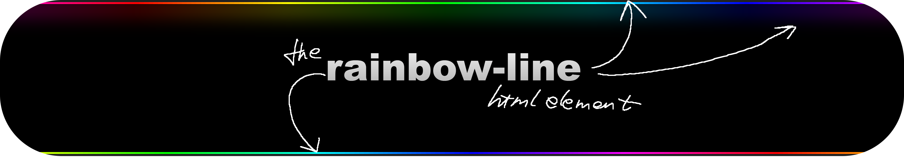

### rainbow-line

 [](https://opensource.org/licenses/Apache-2.0)

A custom element that displays a cut line animated with rainbow colors ..

```html
<rainbow-line
  color-slice-width="10"
  slice-cycle-time="7"
  cycle-direction="left"
></rainbow-line>

<script type="module" src="https://www.unpkg.com/rainbow-line@latest"></script>
```



see [example.html](example.html) for more usage examples

live preview at &rarr; [jsfiddle.net/spearwolf/spjbqnxd/](https://jsfiddle.net/spearwolf/spjbqnxd/)


## Copyright and License

Copyright &copy; 2024 by [Wolfger Schramm](mailto:wolfger@spearwolf.de?subject=[GitHub]%20@spearwolf/offscreen-display).

The source code and npm package is licensed under the [Apache-2.0 License](./LICENSE).


<small>have fun!</small>
🚀🌱
