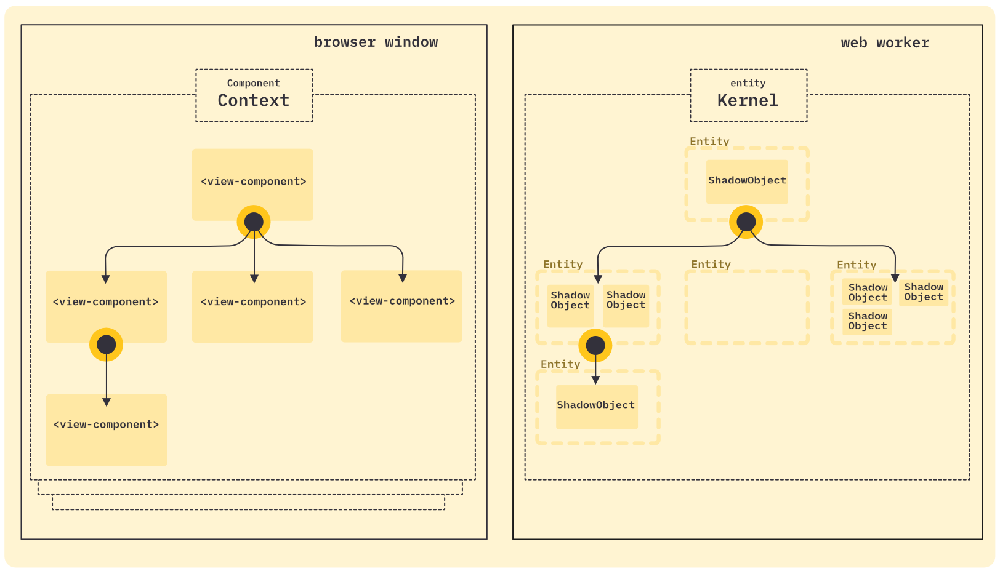

# shadow-ents

> _ents_ is short for latin _"entitatis"_, which translates to _"shadow entities"_

> Each _entity_ belongs to a _html dom element_, but exists in a _web worker_ (therefore called _shadow-entity_, because they are outside the main document, analogous to the elements in a _html shadow dom_).

A `<view-component/>` inside in the browser window is a _custom element_ and serves as an access point for the entities.
A _shadow-entity_ in the worker thread is always associated with exactly one view-component in the main document of the browser.

Since the view-components are native html elements in the dom, they form a hierarchy of their own (if you hide the other html elements).
This hierarchy is inherited exactly by the entities in the worker. The entity tree automatically reflects any changes made to the view-component hierarchy.
 
The root of a view-component hierarchy is always the _component-context_. The context creates a web worker and is responsible for synchronising the entities with their components.

Within the entity worker there is the _kernel_, the counterpart to the component-context, which is responsible for the lifecycle of the entities and their _shadow-objects_.

When a view-component is created, a string based token and multiple tags can be applied.
The kernel decides which shadow-objects to create within each entity based on the token and tags.

More than one shadow-object can be added to a single entity.

The view-components do not know which shadow-objects are assigned to their entity, but all shadow-objects have access to the property data of the view-component through the entity. The view-components can also send events to their entities, which are then passed on to the shadow-objects. This also works the other way around, the shadow-objects can send events to the view-components.

However, unlike bidirectional events, property synchronization is only in one direction, from view-components to entities.
