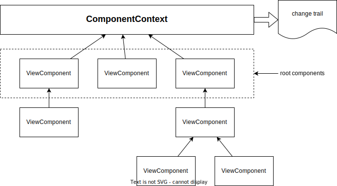

# ComponentContext



The [`ComponentContext`](./ComponentContext.ts) class is the state store for the [view components](./ViewComponent.md).

The contexts are each assigned to a *namespace*. The context for a namespace is simply queried using the *get* method:

```js
const ctx = ComponentContext.get('my-namespace');
```

If you do not specify a namespace, the default namespace will be returned:

```js
const ctx = ComponentContext.get();
```

The [view components](./ViewComponent.md) are stored hierarchically in a tree structure. It is possible to have multiple roots (view components) in a context.

## Build change trail

When the `ComponentContext.buildChangeTrail()` method is called, the component context creates a data structure that maps the entire state of all view components at the time of the call into json data. This is the _change trail_.
Subsequent calls create a _change trail_ that contains the _changes_ to the view components from the previous call.
