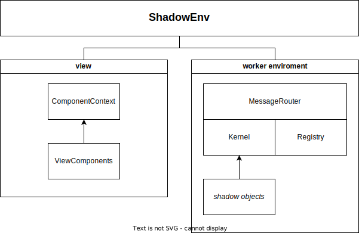

# ShadowEnv

The _ShadowEnv_ class connects the _view_ with the _shadow object environment_ and is responsible for synchronizing the states.

The _view_ consists of the [ComponentContext](./ComponentContext.md) and the [view components](./ViewComponent.md) contained within it.

The _shadow object environment_ is the runtime environment for all _shadow objects_ and consists of the _MessageRouter_, the _Kernel_, and the _Registry_.

The _shadow object environment_ can be in the same browser main thread "local" or alternatively a remote environment, e.g. in a separate web worker.

## API

### ShadowEnv

The _ShadowEnv_ class API is simple, consisting of a few properties, methods and events.

#### Properties

**.view:** _ComponentContext_

**.shadowObjectEnvironment:** _IShadowObjectEnvironment_

#### Methods

**.sync():** _Promise&lt;void&gt;_

#### Events

- `onSync`
- `contextCreated`
- `contextLost`

### IShadowObjectEnvironment

Whether it is local or remote, a _shadow object environment_ always provides the following API:

#### Methods

> **.importScript(url):** _Promise&lt;void&gt;_

Import a javascript module into the _shadow object environment_. the module can register _shadow objects_ components using the _token_ or define _routing_ rules for the _MessageRouter_.

> **.configure(data):** _void_

Configure _routing_ rules for the _MessageRouter_.

> **.applyChangeTrail(data):** _Promise&lt;void&gt;_

Apply the _change trail_ in the _shadow object environment_. the _change trail_ is interpreted by the _Kernel_ and as a result the _shadow objects_ are created, updated or destroyed. based on the _routing_ rules.

> **.destroy():** _void_

Destroy the entire environment with all instances of shadow objects.
Reset the routing rules and forget about the modules that were imported.
