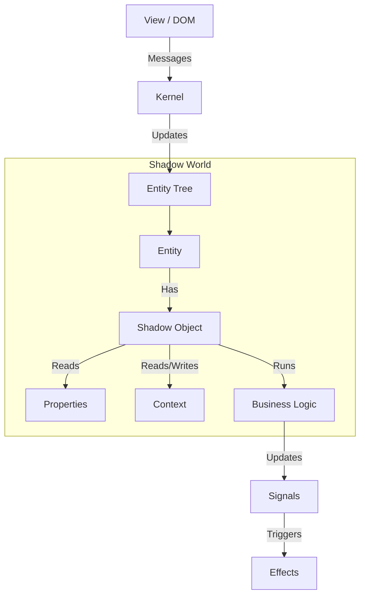

_hi! welcome to .._
# Shadow Objects Framework 🧛

The **Shadow Objects Framework** is a library for managing application state and logic that runs "in the dark" (in a worker or separate context), mirroring a view hierarchy (like the DOM). It decouples business logic and state management from the UI rendering layer.

## Core Concepts

### 1. Entities
An **Entity** is the fundamental unit in the framework. It represents a node in the hierarchy, mirroring a view component (e.g., a Web Component or a DOM element).
- **Hierarchy**: Entities have parents and children, forming a tree structure.
- **Properties**: Entities hold reactive properties that sync with the view.
- **Context**: Entities participate in a hierarchical context system (dependency injection).

### 2. Shadow Objects
A **Shadow Object** is a functional unit of logic attached to an Entity.
- **Logic Containers**: They contain the state, effects, and business logic for a specific feature.
- **Lifecycle**: They are automatically created and destroyed by the **Kernel** based on the Entity's **Token**.
- **Reactivity**: They use **Signals** and **Effects** (via `@spearwolf/signalize`) to react to changes in properties or context.

### 3. The Kernel
The **Kernel** is the brain of the framework.
- **Manages Entities**: Handles creation, destruction, and hierarchy updates of Entities.
- **Orchestrates Shadow Objects**: Instantiates the correct Shadow Objects for each Entity based on its Token and the Registry.
- **Message Dispatch**: Handles communication between the View (UI) and the Shadow World.

### 4. The Registry
The **Registry** maps **Tokens** to **Shadow Object Constructors**.
- **Tokens**: Strings that identify what logic an Entity should have (e.g., `"my-component"`).
- **Routes**: Defines rules for composing multiple Shadow Objects. For example, a token can "route" to other tokens, causing multiple Shadow Objects to be instantiated for a single Entity.
- **Conditional Routing**: Routes can be triggered based on the presence of specific "truthy" properties on the Entity (e.g., `@myProp` routes only if `myProp` is set).

## Lifecycle

1.  **Creation**: When an Entity is created (e.g., a Web Component connects), the Kernel looks up its Token in the Registry.
2.  **Instantiation**: The Kernel instantiates all Shadow Objects associated with that Token (and its routes).
3.  **Execution**: The Shadow Object function runs, setting up signals, effects, and context providers.
4.  **Updates**:
    *   **Properties**: When view properties change, the Entity's signals update, triggering any dependent effects in the Shadow Object.
    *   **Context**: If a parent Entity changes a provided context, child Shadow Objects consuming that context automatically update.
5.  **Destruction**: When an Entity is removed or its Token changes, the Kernel destroys the associated Shadow Objects, cleaning up all signals and effects.

## API: Writing Shadow Objects

Shadow Objects are defined as functions (or classes) that receive a `ShadowObjectParams` object.

```typescript
import { ShadowObjectParams } from "@spearwolf/shadow-objects";

export function MyShadowObject({
  useProperty,
  useProperties,
  useContext,
  provideContext,
  useResource,
  createEffect,
  on
}: ShadowObjectParams) {

  // 1. Read Properties from the View
  const getTitle = useProperty("title");
  // or bulk access:
  const props = useProperties({
    title: "title",
    isEnabled: "enabled"
  });

  // 2. Consume Context from Parents
  const getTheme = useContext("theme");

  // 3. Manage Resources (Lifecycle)
  // Automatically creates/destroys the resource when dependencies change
  const myService$ = useResource(() => {
    const title = props.title();
    if (!title) return;
    return new MyService(title);
  }, (service) => service.dispose());

  // 4. Provide Context to Children
  // Can pass a value or a signal directly
  provideContext("myService", myService$);

  // 5. Side Effects
  createEffect(() => {
    console.log("Title changed to:", props.title());
  });

  // 6. Event Listeners
  on(entity, "some-event", (data) => { /* ... */ });
}
```

### Key API Methods

*   **`useProperty(name)`**: Returns a signal reader for a specific property on the Entity.
*   **`useProperties(map)`**: Returns an object of signal readers for multiple properties.
*   **`useContext(name)`**: Returns a signal reader for a value provided by a parent Entity.
*   **`provideContext(name, value)`**: Makes a value (or signal) available to descendant Entities.
*   **`useResource(factory, cleanup)`**: A helper to create and manage objects that need explicit cleanup (like Three.js objects or subscriptions).
*   **`createEffect(callback)`**: Runs a side effect whenever accessed signals change.
*   **`createSignal(initialValue)`**: Creates a local reactive state.

## Architecture Diagram


