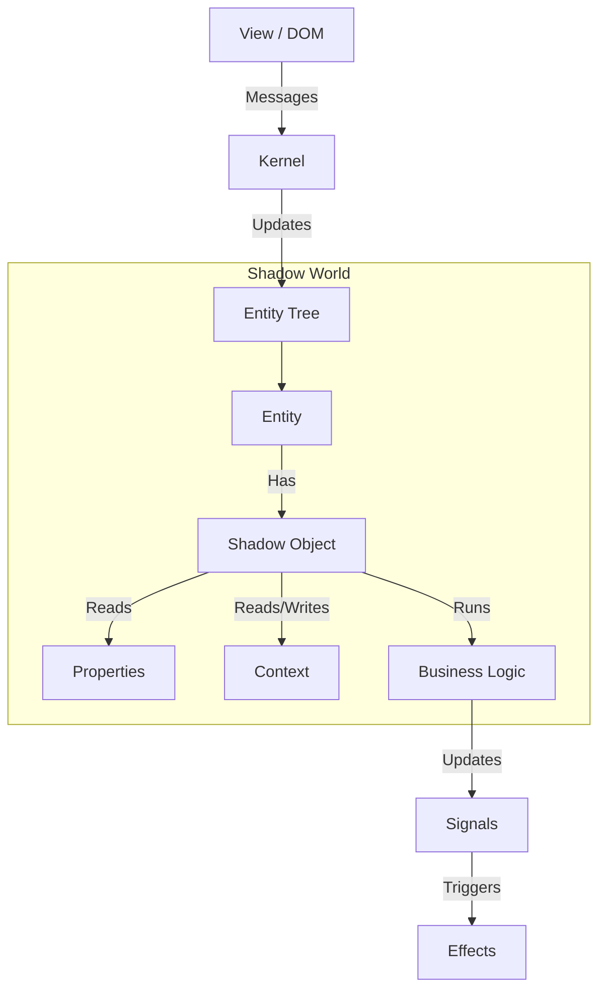

# Shadow Objects Framework 🧛

The **Shadow Objects Framework** is a reactive library designed to decouple business logic and state management from the UI rendering layer. It runs application logic "in the dark" (e.g., in a web worker), mirroring the view hierarchy of your application.

> [!WARNING]
> 🚀 This is a highly experimental framework that is slowly maturing. Use at your own risk. 🔥

## Core Concepts

### 1. Entities
An **Entity** is the fundamental unit in the framework. It represents a node in the hierarchy, mirroring a view component (e.g., a Web Component or a DOM element).
- **Hierarchy**: Entities have parents and children, forming a tree structure.
- **Properties**: Entities hold reactive properties that sync with the view.
- **Context**: Entities participate in a hierarchical context system (dependency injection).

### 2. Shadow Objects
A **Shadow Object** is a functional unit of logic attached to an Entity.
- **Logic Containers**: They contain the state, effects, and business logic for a specific feature.
- **Lifecycle**: They are automatically created and destroyed by the **Kernel** based on the Entity's **Token**.
- **Reactivity**: They use **Signals** and **Effects** (via `@spearwolf/signalize`) to react to changes in properties or context.

### 3. The Kernel
The **Kernel** is the brain of the framework.
- **Manages Entities**: Handles creation, destruction, and hierarchy updates of Entities.
- **Orchestrates Shadow Objects**: Instantiates the correct Shadow Objects for each Entity based on its Token and the Registry.
- **Message Dispatch**: Handles communication between the View (UI) and the Shadow World.

### 4. The Registry
The **Registry** maps **Tokens** to **Shadow Object Constructors**.
- **Tokens**: Strings that identify what logic an Entity should have (e.g., `"my-component"`).
- **Routes**: Defines rules for composing multiple Shadow Objects. For example, a token can "route" to other tokens, causing multiple Shadow Objects to be instantiated for a single Entity.
- **Conditional Routing**: Routes can be triggered based on the presence of specific "truthy" properties on the Entity (e.g., `@myProp` routes only if `myProp` is set).

---

## Developer Guide

### 1. Defining Shadow Objects

You can define a Shadow Object as a **Function** or a **Class**. Both receive a `ShadowObjectCreationAPI` object containing the API methods.

#### Function-based (Recommended)

```typescript
import { ShadowObjectCreationAPI } from "@spearwolf/shadow-objects";

export function MyShadowObject({
  useProperty,
  useContext,
  createEffect,
  on,
  onDestroy
}: ShadowObjectCreationAPI) {

  // 1. Read Properties
  const title = useProperty("title");

  // 2. React to changes
  createEffect(() => {
    console.log("Title is now:", title());
  });

  // 3. Handle Lifecycle
  onDestroy(() => {
    console.log("Shadow Object destroyed");
  });

  // 4. Return public methods (optional)
  return {
    someMethod() { /* ... */ }
  };
}
```

#### Class-based

```typescript
import { ShadowObjectCreationAPI } from "@spearwolf/shadow-objects";

export class MyShadowObject {
  constructor({ useProperty, createEffect, onDestroy }: ShadowObjectCreationAPI) {
    const title = useProperty("title");

    createEffect(() => {
      console.log("Title is now:", title());
    });

    onDestroy(() => this.cleanup());
  }

  cleanup() {
    console.log("Shadow Object destroyed");
  }
}
```

### 2. The Shadow Object Creation API

The `ShadowObjectCreationAPI` object provides all necessary tools to interact with the Entity, the View, and the Context system.

| Method | Description |
| :--- | :--- |
| **`useProperty(name)`** | Returns a signal reader for a specific property on the Entity. Updates when the view property changes. |
| **`useProperties(map)`** | Returns an object of signal readers for multiple properties. |
| **`useContext(name)`** | Consumes a context value provided by a parent Entity. |
| **`useParentContext(name)`** | Skips the current Entity and consumes context directly from the parent. |
| **`provideContext(name, value)`** | Provides a context value (or signal) to descendant Entities. |
| **`provideGlobalContext(name, value)`** | Provides a context value globally to all Entities. |
| **`createResource(factory, cleanup)`** | Manages an external resource (e.g., a Three.js object) with automatic cleanup when dependencies change. |
| **`createEffect(callback)`** | Runs a side effect whenever accessed signals change. |
| **`createSignal(initialValue)`** | Creates a local reactive state signal. |
| **`createMemo(factory)`** | Creates a derived signal that updates only when dependencies change. |
| **`on(target, event, callback)`** | Listens for events on the Entity or other event targets. |
| **`once(target, event, callback)`** | Listens for an event exactly once. |
| **`onDestroy(callback)`** | Registers a callback to be executed when the Shadow Object is destroyed. |

### 3. Registering Shadow Objects

Shadow Objects are organized in **Modules**. A module defines which Tokens map to which Shadow Objects.

```typescript
// my-module.ts
import { MyShadowObject } from "./MyShadowObject";

export default {
  // Map tokens to constructors
  define: {
    "my-component": MyShadowObject,
  },
  // Define routing rules
  routes: {
    "my-component": ["mixin-logger", "mixin-analytics"], // Composition
    "@debug": ["debug-overlay"], // Conditional routing based on 'debug' property
  }
};
```

### 4. View Integration

In your HTML or View layer, you use the provided Web Components to create the Entity hierarchy.

```html
<!-- 1. Initialize the Environment -->
<shae-worker-env src="./my-module.js"></shae-worker-env>

<!-- 2. Create Entities -->
<shae-ent token="my-component">
  <!-- Properties -->
  <shae-prop name="title" value="Hello World"></shae-prop>

  <!-- Nested Entities -->
  <shae-ent token="child-component"></shae-ent>
</shae-ent>
```

---

## Architecture & Internals

### Lifecycle

1.  **Creation**: When an Entity is created (e.g., `<shae-ent>` connects), the Kernel looks up its Token in the Registry.
2.  **Instantiation**: The Kernel instantiates all Shadow Objects associated with that Token (and its routes).
3.  **Execution**: The Shadow Object function runs, setting up signals, effects, and context providers.
4.  **Updates**:
    *   **Properties**: When view properties change, the Entity's signals update, triggering any dependent effects in the Shadow Object.
    *   **Context**: If a parent Entity changes a provided context, child Shadow Objects consuming that context automatically update.
5.  **Destruction**: When an Entity is removed or its Token changes, the Kernel destroys the associated Shadow Objects, cleaning up all signals and effects.

### Architecture Diagram



### Further Reading

For deep dives into specific subsystems:

-   [**ShadowEnv**](src/view/README.md): The environment wrapper.
-   [**ComponentContext**](src/view/ComponentContext.md): Context implementation details.
-   [**ViewComponent**](src/view/ViewComponent.md): Base class for view components.
