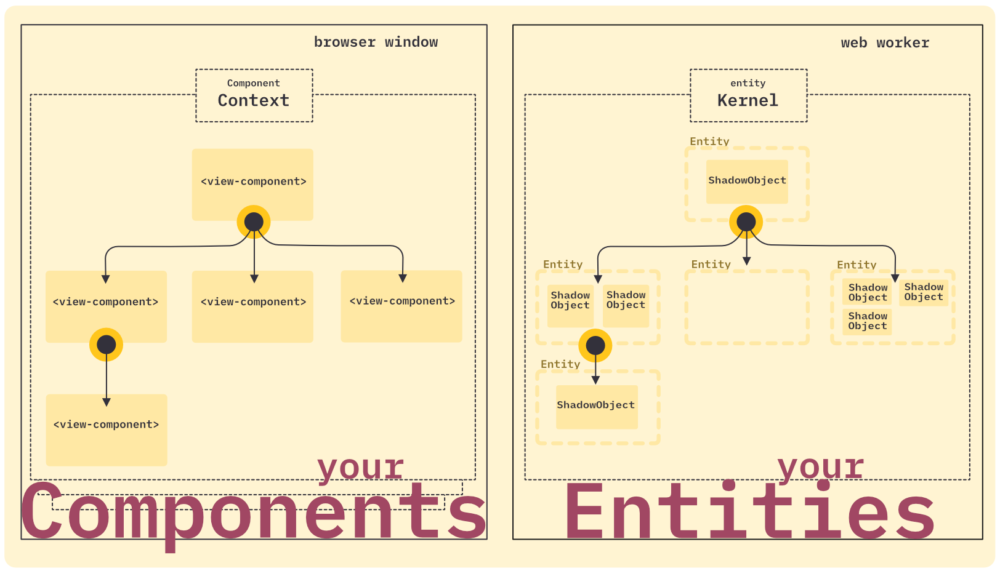

_hi! welcome to .._
# shadow-objects :wave:

## Introduction

_Shadow-objects_ is a standalone entity component framework.
The original idea is visualized in this overview:



> _ents_ is short for latin _"entitatis"_, which translates to _"shadow entities"_

> [!IMPORTANT]
> _Dear adventurer, be warned: everything here is highly experimental and in active development and constant flux!_

The components are created in the view space. Hierarchical. In your browser. There is a JavaScript API for this. But to keep things simple, there are also ready-to-use web components.

```html
<shae-worker-env local? src="./my-personal-shadow-objects.js" />

<shae-ent ns? token="foo">
  <shae-ent ns? token="bar">
    <shae-prop name="myNumbers" value="1 2 3" type="integer[]" />
  </shae-ent>
</shae-ent>
```

> [!WARNING]
> Sorry, at this point there should be a precise and crisp introduction to the concepts of the framework, but unfortunately this is not currently available.
> Instead of that, a few insights into the implementation will follow

Here is the big class graph overview:


More in-depth docs here:
- [ShadowEnv](./src/view/README.md)
- [ComponentContext](./src/view/ComponentContext.md)
- [ViewComponent](./src/view/ViewComponent.md)
