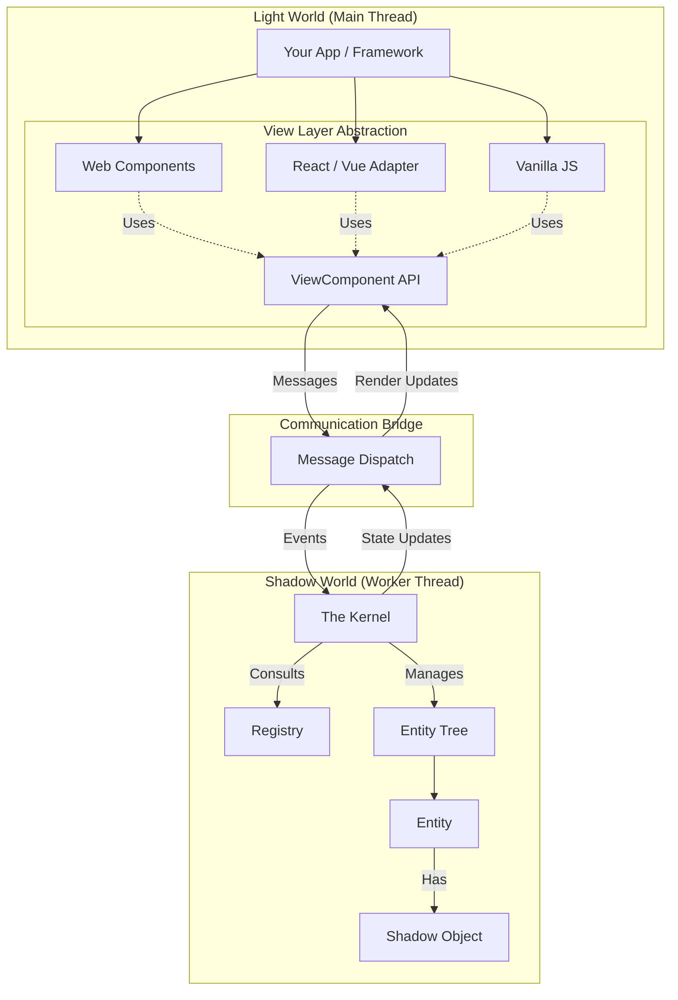

# Architecture

This section details how the Shadow Objects framework orchestrates the communication between the View and the Logic, and how its internal systems operate.

## System Overview

The architecture revolves around a central **Kernel** that manages the lifecycle of the Shadow World and mediates communication.

A key architectural decision is that the **View Layer is abstract**. While the framework provides ready-to-use Web Components, they are built on top of a lower-level JavaScript API that you can use directly.

## Core Components

### 1. The Kernel
The **Kernel** is the engine of the Shadow World.
*   **Entity Management:** It maintains the `EntityTree`, handling the creation, movement, and destruction of Entities mirroring the DOM structure.
*   **Orchestration:** When an Entity is created, the Kernel asks the **Registry** "What logic belongs to this Token?" and instantiates the corresponding Shadow Objects.
*   **Scheduling:** It manages the reactive update cycle, ensuring changes propagate efficiently.

### 2. The Registry
The **Registry** is the configuration lookup table.
*   **Mapping:** It maps **Tokens** (strings) to **Shadow Object Constructors**.
*   **Routing:** It defines complex composition rules. A single Token in the view might trigger multiple Shadow Objects in the logic (e.g., a "button" token might load the `ButtonLogic` *and* a `AnalyticsMixin`).
*   **Conditional Routing:** Routes can be dynamic, loading logic only if certain properties are present on the Entity.

### 3. Message Dispatch
Because the Light World and Shadow World often run in different threads (Main vs. Worker), they cannot share memory directly. They communicate via **Messages**.
*   **View -> Shadow:** Property changes, DOM events, and lifecycle hooks are sent as messages to the Kernel.
*   **Shadow -> View:** State changes in Shadow Objects are batched and sent back to update the View.

## The View Layer & ViewComponent API

The framework interacts with the "Light World" through the **ViewComponent API**. This is a JavaScript interface that handles the message passing and synchronization with the Kernel.

### Web Components (The Default Implementation)
The standard way to use Shadow Objects is via the provided Web Components (`<shae-worker>`, `<shae-ent>` and `<shae-prop>`).
*   **Role:** These are simply a convenience wrapper.
*   **Function:** They automatically handle the lifecycle (mount/unmount) and property syncing by calling the ViewComponent API internally.

### Custom Integrations & Hierarchies
Because the architecture relies on the ViewComponent API, you are not forced to use Web Components or even the DOM structure.

The View Components form their own hierarchy. While the predefined Web Components (`<shae-ent>`) conveniently mirror the DOM structure, this is just one possible implementation.

The View Components API allows you to model **any logical hierarchy** representing your application's state and logic. This is a deliberate design choice:

*   **Non-DOM Structures:** You can map Shadow Objects to nodes inside a GLTF file (3D model), a scenegraph in a game engine, or an abstract data structure.
*   **React/Vue/Svelte:** You could write a wrapper that syncs a React component's lifecycle to Shadow Objects.
*   **Vanilla JS:** You can instantiate `ViewComponent` classes directly in plain JavaScript code if you don't want to use DOM elements.

## Communication Patterns

### Property Synchronization (Downstream)
Data flows primarily **down** from the View to the Shadow World.
1.  **View Update:** The View (e.g., via attribute change on `<shae-ent>` or direct API call) updates a property.
2.  **Message:** The ViewComponent API sends a message to the Kernel.
3.  **Kernel Update:** Kernel updates `Entity.properties`.
4.  **Reaction:** Shadow Object's `useProperty` signal updates, triggering Effects.

### Events (Upstream & Lateral)
Shadow Objects can emit events or react to them.
*   **DOM Events:** Forwarded from View to Entity.
*   **Internal Events:** Entities can emit events to communicate with parents or children without direct references.

### Context (Dependency Injection)
The framework implements a hierarchical **Context** system similar to React Context or Angular Services.
*   **Provider:** An Entity provides a value (or signal).
*   **Consumer:** Any descendant Entity can consume that value.
*   **Reactive:** If the provider updates the value, all consumers update automatically.
