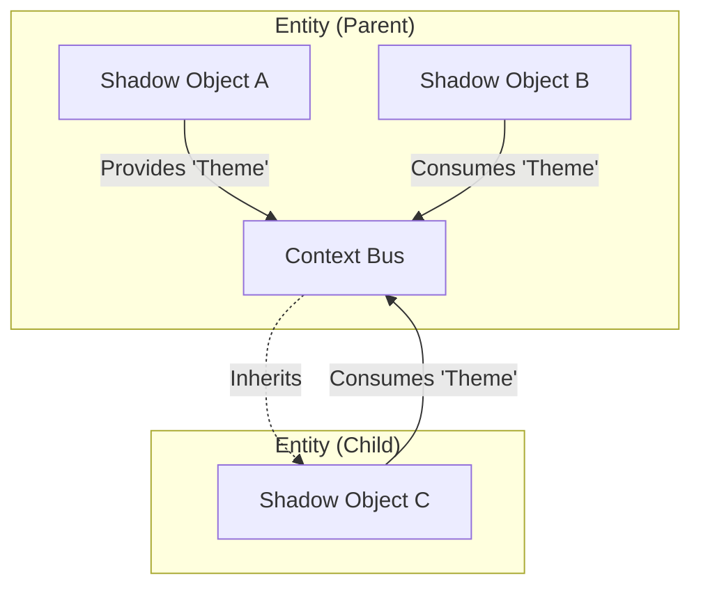

# Entity Tree, Context & Events

This section explores the hierarchical nature of the Shadow World, explaining how data and events flow through the **Entity Tree**.


## The Entity Tree

At the core of the Shadow World is the **Entity Tree**. This tree structure mirrors the hierarchy of your View components (e.g., the DOM structure of `<shae-ent>` elements).

### Hierarchy

- **Entities (Puppets):** These are the nodes in the tree. Every `<shae-ent>` in your HTML corresponds to one Entity instance in the Shadow World.
- **Shadow Objects (Logic):** Shadow Objects are **attached** to these Entities.

> [!IMPORTANT]
> **Shadow Objects are NOT nodes in the tree.**
> They are "components" or "behaviors" attached to an Entity node.
>
> - An Entity can have multiple Shadow Objects (via Routing).
> - All Shadow Objects on the same Entity share the same properties and lifecycle.

## Context (Dependency Injection)

Context allows you to share data deep into the component tree without passing props manually at every level ("prop drilling").

### How it Works

1.  **Provider:** A Shadow Object on an Entity calls `provideContext`.
2.  **Scope:** This value becomes available to:
    - **All other Shadow Objects on the same Entity.**
    - **All Shadow Objects on descendant (child) Entities.**
3.  **Consumer:** A Shadow Object calls `useContext` to read the value.

### Context is Entity-Bound

Since Context is attached to the **Entity**, it acts as a shared bus for all logic attached to that node.

- If `ShadowObject A` provides a context, `ShadowObject B` (on the same Entity) can immediately consume it.
- This is the primary way to compose complex logic from smaller, reusable Shadow Objects.



### Reactivity

Context values are **Signals**.

- If the Provider updates the value, all Consumers (even deep in the tree) update automatically.
- You don't need to subscribe manually; just reading the value in an effect creates a dependency.

## Events

The framework provides a powerful event system based on [@spearwolf/eventize](https://github.com/spearwolf/eventize). This allows decoupled communication between Shadow Objects, Entities, and the View.

### The Event Bus: The Entity

Every Entity acts as an event emitter. Since multiple Shadow Objects can be attached to the same Entity, the Entity serves as a shared "bus" for them.

- **Shared Scope:** If one Shadow Object emits an event on its Entity, **all other Shadow Objects on that same Entity** can receive it.
- **Decoupling:** Shadow Objects don't need to know about each other; they just listen to the Entity they are attached to.

### 1. View -> Shadow Events

Events dispatched by the View Component are automatically forwarded to the corresponding Entity as _View Events_.

- **View Layer:**
  ```javascript
  // In your Web Component or View Logic
  this.viewComponent.dispatchShadowObjectsEvent('my-custom-event', {some: 'data'});
  ```
- **Shadow World:**
  ```typescript
  // Your Shadow Object
  export function MyLogic({onViewEvent}: ShadowObjectCreationAPI) {
    onViewEvent((type, data) => {
      if (type === 'my-custom-event') {
        console.log('Received from View:', data);
      }
    });
  }
  ```

### 2. Shadow Object -> Shadow Object (Same Entity)

Shadow Objects attached to the same Entity can communicate via events.

```typescript
import {emit} from '@spearwolf/eventize';

// Feature A
export function FeatureA({on}: ShadowObjectCreationAPI) {
  // Listen for event from Feature B
  on('data-loaded', (data) => {
    /* ... */
  });
}

// Feature B
export function FeatureB({entity}: ShadowObjectCreationAPI) {
  // Emit event via the entity
  emit(entity, 'data-loaded', {id: 123});
}
```

### 3. Broadcasting to Children (Traverse the Entity Tree)

You can broadcast events to all descendant Entities using the `traverse` helper. This is useful for "global" updates like a frame tick or a resize event.

```typescript
import {emit} from '@spearwolf/eventize';

export function StageController({entity, on}: ShadowObjectCreationAPI) {
  // Example: Broadcast a 'frame-update' event to the entire subtree
  on('tick', (deltaTime) => {
    entity.traverse((e) => {
      emit(e, 'frame-update', {deltaTime});
    });
  });
}
```

> [!NOTE]
> `traverse()` visits first the current entity and then all its descendants recursively.

### 4. Shadow -> View Events

You can send events back to the View Layer using `dispatchMessageToView`.

- **Shadow World:**
  ```typescript
  export function MyLogic({dispatchMessageToView}: ShadowObjectCreationAPI) {
    dispatchMessageToView('notify', {message: 'Save successful!'});
  }
  ```
- **View Layer:**

  ```javascript
  import {on} from '@spearwolf/eventize';

  on(viewComponent, {
    notify(data) {
      console.log('Received a notification:', data);
    },
  });
  ```

> [!TIP]
> **Forwarding to DOM:** If you are using `<shae-ent>`, you can automatically forward these events to the DOM element using the `forward-custom-events` attribute. See the [Web Components API](../03-api/04-web-components.md#forward-custom-events) for details.
