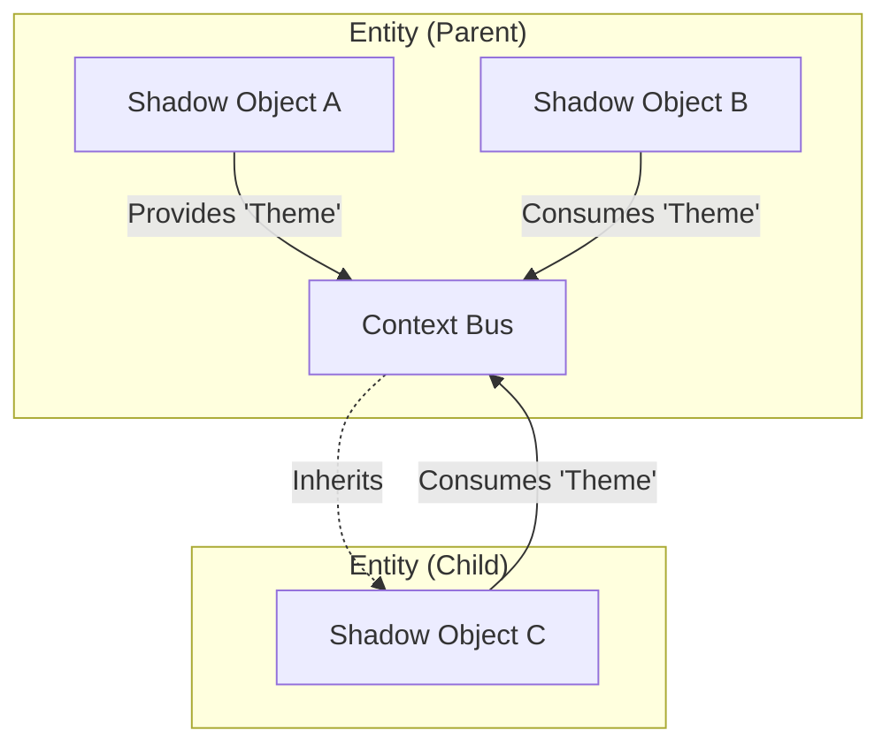

# Entity Tree, Context & Events

This section explores the hierarchical nature of the Shadow World, explaining how data and events flow through the **Entity Tree**.

## The Entity Tree

At the core of the Shadow World is the **Entity Tree**. This tree structure mirrors the hierarchy of your View components (e.g., the DOM structure of `<shae-ent>` elements).

### Hierarchy
*   **Entities (Puppets):** These are the nodes in the tree. Every `<shae-ent>` in your HTML corresponds to one Entity instance in the Shadow World.
*   **Shadow Objects (Logic):** Shadow Objects are **attached** to these Entities.

> [!IMPORTANT]
> **Shadow Objects are NOT nodes in the tree.**
> They are "components" or "behaviors" attached to an Entity node.
>
> *   An Entity can have multiple Shadow Objects (via Routing).
> *   All Shadow Objects on the same Entity share the same properties and lifecycle.

## Context (Dependency Injection)

Context allows you to share data deep into the component tree without passing props manually at every level ("prop drilling").

### How it Works
1.  **Provider:** A Shadow Object on an Entity calls `provideContext`.
2.  **Scope:** This value becomes available to:
    *   **All other Shadow Objects on the same Entity.**
    *   **All Shadow Objects on descendant (child) Entities.**
3.  **Consumer:** A Shadow Object calls `useContext` to read the value.

### Context is Entity-Bound
Since Context is attached to the **Entity**, it acts as a shared bus for all logic attached to that node.

*   If `ShadowObject A` provides a context, `ShadowObject B` (on the same Entity) can immediately consume it.
*   This is the primary way to compose complex logic from smaller, reusable Shadow Objects.

### Reactivity
Context values are **Signals**.
*   If the Provider updates the value, all Consumers (even deep in the tree) update automatically.
*   You don't need to subscribe manually; just reading the value in an effect creates a dependency.

## Events

Events allow communication up the tree or locally between logic units.

### View Events
Standard DOM events can be forwarded to the Shadow World.
*   **View:** Component dispatches `customEvent`.
*   **Shadow:** `on(entity, 'customEvent', callback)` triggers.

### Inter-Entity Events
Entities can emit events that bubble up or are handled locally. This is useful for:
*   **Child -> Parent:** Notifying a parent controller of a child's action.
*   **Sibling Communication:** If two Shadow Objects on the same Entity need to coordinate via events instead of state.
