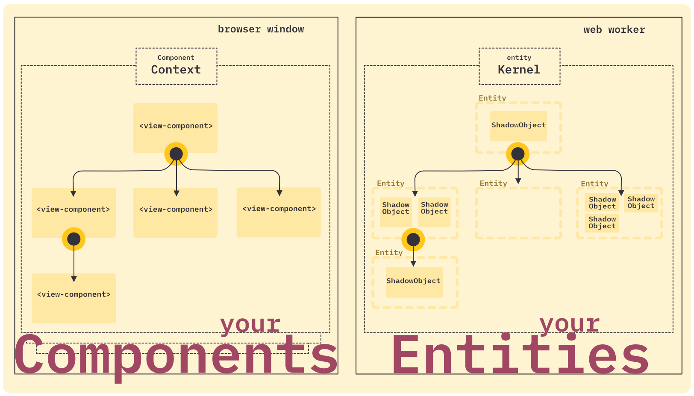

# The Mental Model

The **Shadow Objects Framework** is built upon a strict separation of concerns. To help you visualize how this works, let's start with a simple analogy.

## Analogy: The Shadow Theater

Imagine a **Shadow Theater** (Wayang Kulit).

*   **The Screen (The View):** The audience watches the screen. They see moving shapes and stories unfolding. This is your UI (HTML/CSS).
*   **The Puppets (The Entities):** Behind the screen are the puppets. They are the actual objects with structure and form.
*   **The Puppeteer (The Logic/Shadow Object):** The puppeteer manipulates the puppets, deciding how they move and react based on the script.

In Shadow Objects:
*   You don't script the screen directly (no `document.querySelector` to update text).
*   You script the **Puppeteer** (Shadow Object).
*   The framework projects the state of the puppets onto the screen automatically.

## The Two Worlds

This analogy maps to two distinct realms in your application, as shown in the architecture diagram:

### 1. Browser Window (your Components)
This is what the user sees and interacts with. It consists of the DOM, Web Components, and the rendering layer.
*   **Role:** Pure projection and user input.
*   **State:** Minimal / Transient. Ideally, the view should not hold business logic state.
*   **Environment:** The Main Thread.
*   **Context:** Can be partitioned into multiple **Namespaces** (e.g. `main-game`, `ui-overlay`) to run isolated simulations side-by-side.

### 2. Web Worker (your Entities)
This is where your application actually "lives". It contains the business logic, state management, and side effects.
*   **Role:** Processing logic, managing state, handling data.
*   **State:** The source of truth.
*   **Environment:** Typically a **Web Worker** (the "Dark"), but can also run on the Main Thread (Local Context) for simple setups.
*   **Isolation:** Each Context has its own Kernel and Entity Tree.

## Core Concepts

To bridge these two worlds, we use four fundamental concepts:

### 1. Entity (The Puppet)
An **Entity** is the abstract representation of a component. It exists in the Shadow World but mirrors a node in the View hierarchy.
*   Forms a tree structure (Parent/Child).
*   Holds **Properties** (data syncing from View).
*   Participates in the **Context** system.

### 2. Shadow Object (The Brain)
A **Shadow Object** is a functional unit of logic attached to an Entity.
*   It is the "code" that runs for a specific component.
*   It is reactive: it listens to property changes and triggers effects.
*   It can talk to other Shadow Objects via Context.

### 3. Token (The Name)
A **Token** is a simple string identifier (e.g., `"my-button"`, `"user-profile"`) that links the View to the Logic.
*   In the View: `<shae-ent token="my-button">`
*   In the Registry: `"my-button"` maps to `MyButtonShadowObject`.

> [!NOTE]
> **Token vs. ID:** A `Token` describes *what* the object is (like a class name). The framework assigns unique IDs internally to distinguish specific instances.

### 4. Events (The Signals)
While Properties flow down (from View to Logic), **Events** allow for dynamic communication in both directions.

*   **Inbound (View → Logic):** Entities receive events from the View (like `click`, `submit`, or custom DOM events). Your Shadow Object can listen to these events to trigger actions.
*   **Outbound (Logic → View):** Shadow Objects can emit their own events. These travel back to the View, allowing the UI layer to react to logic decisions (e.g., playing an animation, showing a toast, or navigating).
