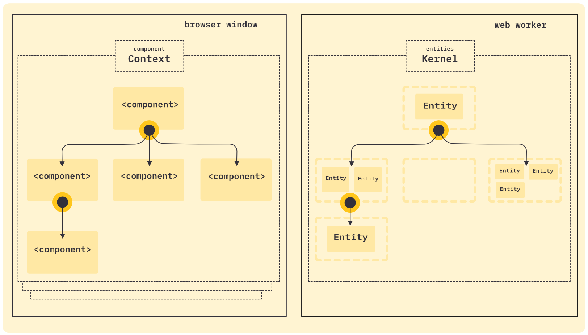

# umbra-ents

> _umbra ents_ is short for latin _"umbra entitatis"_, which translates to _"shadow entities"_

Each _entity_ belongs to a _view component_, but exists in a _web worker_ (therefore called _shadow_, because they are located outside the document, analogous to the elements in a _html shadow DOM_), where the components are located in the main document of the browser window.

The components are arranged in a tree hierarchy, just like in the DOM.
As an entity is always linked to a component, they are also arranged in a hierarchy, just like the components.

How the hierarchy looks is always determined by the view components, and any change to the component hierarchy is automatically reflected in the entities.
 
The root of a component hierarchy is always the _component context_. The context creates a web worker and is responsible for synchronising the entities with their components.

Within the entity worker is the _entity kernel_, which is responsible for the entities and their lifecycles. This is the counterpart to the component context.

When a component is created, a string based id and/or multiple tags can be applied. Based on this data, the kernel decides what types of entities to create and associate with the component. 
 
Multiple entities can be associated with a component.

The component itself does not know which entities are linked to it.
However, all properties (and their changes) of the components are passed on to the associated entities.
Also the components and entities can communicate with each other via events.

The component properties are only passed to the entities in this direction (one-way binding), while the events can be sent and received from both sides.
